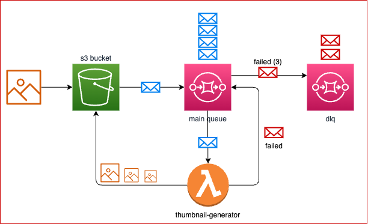

# AWS SQS Thumbnail Generator

A serverless application demonstrating how to decouple image processing using AWS SQS. This project showcases AWS infrastructure design and implementation using AWS CDK.

## Architecture

The application uses the following AWS services:

- **S3 Bucket**: Stores original images and generated thumbnails
  - `/uploads` - Original images
  - `/thumbnails` - Generated thumbnails in different sizes

- **SQS Queue**: Decouples image upload from processing
  - Includes Dead Letter Queue (DLQ) for failed messages
  - Maximum of 3 retries before moving to DLQ

- **Lambda Function**: Processes images and generates thumbnails
  - Runtime: Node.js
  - Uses Sharp library for image processing
  - Generates 3 thumbnail sizes (small: 50px, medium: 150px, large: 300px)

## How it Works

1. Upload an image to the S3 bucket's `/uploads` folder
2. S3 triggers an event notification to SQS
3. Lambda function processes the SQS message
4. Thumbnails are generated and stored in the `/thumbnails` folder
5. SQS message is deleted upon successful processing

## Infrastructure as Code

This project is built using AWS CDK, demonstrating:

- Type-safe infrastructure definition using TypeScript
- Best practices for AWS resource configuration
- Proper IAM permissions and security settings
- Event-driven architecture
- Error handling with Dead Letter Queues

## Development

To modify thumbnail sizes or add new features:

Edit the `THUMBNAIL_WIDTHS` array in `thumbnail-generator.ts`
Update the stack configuration in   `aws-sqs-thumbnail-generator-stack.ts`
Deploy changes using `cdk deploy`
